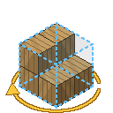

<div align="center">



# About Face Easy Place

### *A Litematica Plugin*

**Litematica's Easy Place, with every block facing the right way on a vanilla server.**

[](https://www.minecraft.net/)
[](https://fabricmc.net/)
[](https://github.com/sakura-ryoko/litematica)
[](#installing)
[](LICENSE)

</div>

---

> Build from a schematic on any normal server and every stair comes out facing whichever way you
> happened to be standing. Pistons point at you. Hoppers feed the wrong way. Repeaters sit on one
> tick, comparators never subtract, and every door is shut.
>
> **This fixes that.** Nothing is needed server-side.

<div align="center">

| | Stairs & furnaces | Pistons & observers | Hoppers & logs | Repeaters & comparators | Doors, gates, trapdoors |
|:--|:--:|:--:|:--:|:--:|:--:|
| **Easy Place alone** | ❌ facing | ❌ facing | ❌ facing | ❌ delay / mode | ❌ always shut |
| **With this** | ✅ | ✅ | ✅ | ✅ | ✅ |

</div>

> [!WARNING]
> **This may trigger anti-cheat.** To get a block placed the right way round, the mod tells the
> server you are looking somewhere you are not — briefly, and only for the placement — and makes the
> clicks that set a repeater or open a door straight after placing it. Every packet is one a player
> could send, and a plain vanilla server accepts all of them, but a server running an anti-cheat
> plugin may see snap rotations or fast clicks and flag, kick or ban you. **Check a server's rules
> before using it there.**

---

## What it does

Easy Place on a server without Carpet or Servux has no way to tell the server which way round a
block goes, so the server decides for itself from where you are looking and which face you
clicked. This mod works out the look and the click that make vanilla's *own* rules produce the
block the schematic asks for, claims them for that one placement, and puts everything back. Your
camera never moves.

- **Facing, axis, half, hinge, rotation** — stairs, slabs, logs, hoppers, furnaces, chests, doors,
  trapdoors, fence gates, signs, banners, skulls, lanterns, end rods, lightning rods, rails.
- **Pistons, observers, dispensers, droppers, crafters and barrels.** These read where your *head*
  is pointing, which a vanilla server only updates once a tick. The mod turns it ahead of time for
  the block under your crosshair, so they go down as fast as anything else.
- **Settings that only exist after placing** — repeater delay, comparator mode, a lone redstone dot,
  note block pitch, daylight detector inversion, levers, and open doors, trapdoors and fence gates.
  The mod uses the block the right number of times as soon as it is down.
- **Hanging signs**, hanging from a ceiling or mounted on a wall, including the chained style.
- **No containers opened by accident.** A click that would open a dropper or chest underneath a
  small schematic block places the block instead, and holding the key does not undo a door or
  repeater that has just been set.

Candidates are tried by asking the block itself what it would place — the same question the server
answers — so anything that cannot be made right is **skipped rather than placed wrongly**, and
Litematica comes back to it.

<details>
<summary><b>Limits</b> — things a vanilla server does not allow</summary>

<br>

- **A lone curved or sloped rail.** Vanilla only curves or slopes a rail towards real neighbouring
  rails. In a connected track they form as the track goes down; an isolated one cannot be made.
- **A skull on a wall that is not there.** Vanilla refuses to place a wall skull without a solid
  block behind it, even though it survives the wall being removed later.
- **A door's hinge next to another door.** The doors beside it decide it. If one is skipped with
  *"the door beside it decides its hinge"*, place that door before its neighbour.
- **Powered state.** Whether something is powered comes from the circuit, not the placement.

</details>

---

## Installing

Drop the jar from the [latest release](https://github.com/SkyStormer1/AboutFaceEasyPlace/releases/latest)
into `.minecraft/mods` alongside:

| | |
|:--|:--|
| [Fabric Loader](https://fabricmc.net/use/) | 0.19.3+ |
| [Fabric API](https://modrinth.com/mod/fabric-api) | |
| [Fabric Language Kotlin](https://modrinth.com/mod/fabric-language-kotlin) | |
| **[Litematica](https://github.com/sakura-ryoko/litematica)** + **MaLiLib** | **0.28.0+ — required** |
| [Mod Menu](https://modrinth.com/mod/modmenu) | optional, for the settings screen |

In Litematica's settings, leave `easyPlaceProtocolVersion` on **Auto**. That is how Litematica tells
a vanilla server from a Carpet or Servux one, and this mod stays out of the way on the latter.

> [!TIP]
> **Tweakeroo users:** turn **Accurate Block Placement** off while Easy Placing. It sends its own
> rotation with every placement, which on a vanilla server fights this mod's. The mod warns you
> once if it notices.

## Using it

There is nothing to switch on. The mod is active exactly when Easy Place is, and only ever touches
blocks the schematic asks for.

It works the same in **single player** as on a vanilla server. On servers running Carpet or Servux,
Litematica's own protocol carries orientation, so the mod steps back — except for what that protocol
misses: it still sets repeaters, comparators, dust dots, doors and the like once they are down.

Settings are behind Mod Menu's cog, or in `config/aboutfaceeasyplace.json`:

| Setting | Default | |
|:--|:--:|:--|
| **Align Easy Place orientation** | on | The master switch. Also on a keybind (unbound by default) under *Controls*. |
| **Skip blocks that cannot be aligned** | on | Off places them anyway, facing however they come out. |
| **Show action bar messages** | on | The occasional note about a skipped block. |
| **Log every placement** | off | One log line per steered placement, and a warning if the server disagreed with it. Worth turning on before reporting a problem. |

## Building

Requires **JDK 25** or newer.

```bash
./gradlew build      # jar lands in build/libs/
```

Litematica is reached by reflection and by name, so no Litematica jar is needed to build.

---

## Licence and origin

**MIT** — see [LICENSE](LICENSE).

Written from scratch; contains no code from Litematica, Tweakeroo, any printer mod or any other
project. Their source was read only to learn how they behave, so this mod can work alongside them.

A companion to [**About Face**](https://github.com/SkyStormer1/AboutFace), and built on the same
idea: present the server with the inputs that produce the answer you want, rather than argue with
the answer it gives. Claiming a rotation and choosing a click are long-standing, widely used
client-side techniques, not inventions of any one mod.

Litematica is by [masa](https://github.com/maruohon), maintained for modern versions by
[Sakura-Ryoko](https://github.com/sakura-ryoko). This mod is a plugin for their work, not a
replacement for it.
